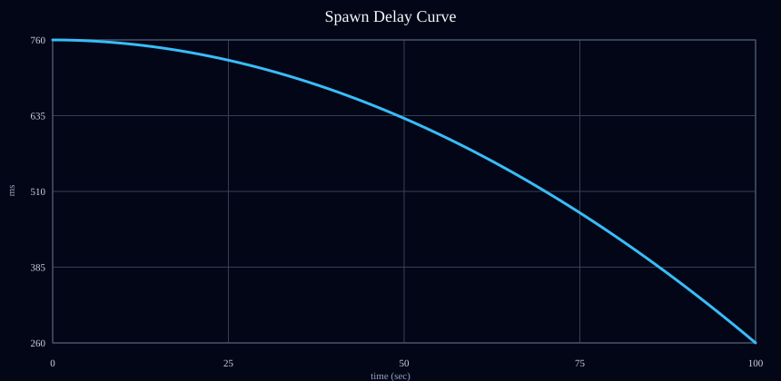
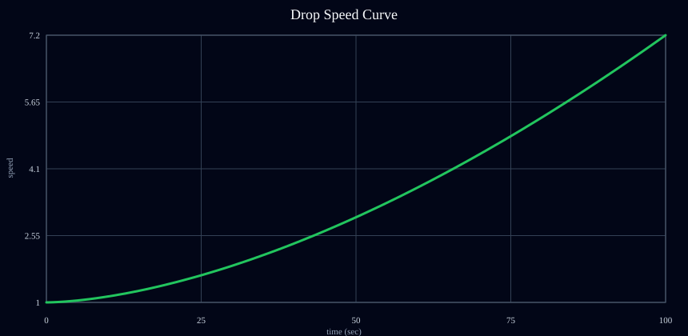
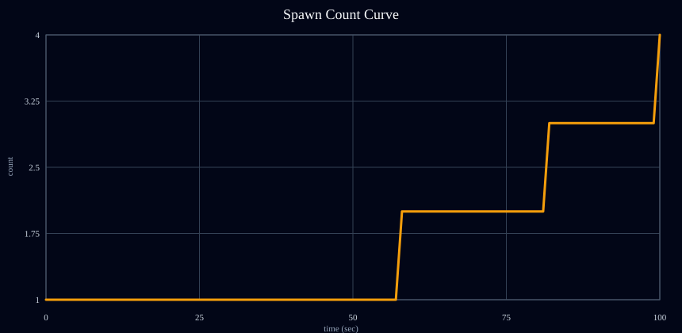
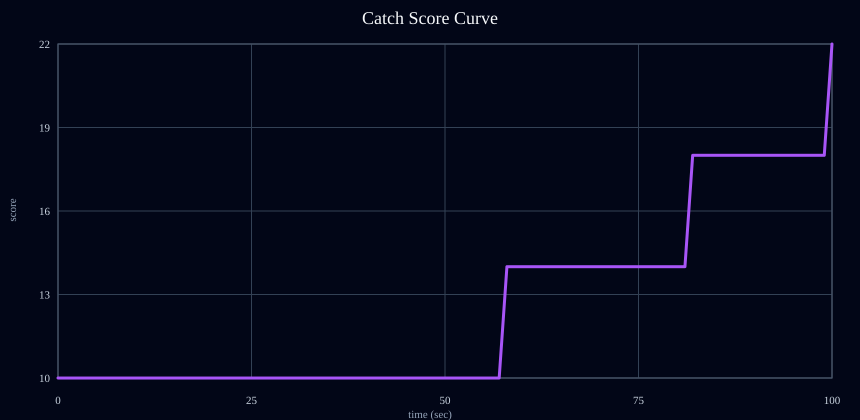

# 밸런스 수치 기준 파일 (Offset Source)

이 문서는 실제 게임 밸런스의 기준이 되는 **오프셋 수치 원본 파일**입니다.  
웨이브 구간 수동 입력 대신, **밸런스 팩터를 조정해서 커브를 제어**하는 방식을 사용합니다.

실제 편집 원본: `balance-config.json`  
런타임 적용: `src/main.ts`가 `balance-config.json`을 import하여 동일 수식으로 계산한다.  
그래프 생성 명령: `npm run balance:graphs` (PowerShell 정책 이슈 시 `npm.cmd run balance:graphs`)

---

## 1) 운영 파라미터 (Factor Set)

아래 파라미터는 `balance-config.json` 기준입니다.  
값을 수정한 뒤 `npm run balance:graphs`를 실행하면 그래프와 스냅샷이 갱신됩니다.

| 분류 | 키 | 값 |
|---|---|---:|
| 라운드 기준 시간(초) | `roundDurationSec` | 100 |
| 기본 점수 | `scorePerCatch` | 0 |
| 3매칭 보너스 | `matchBonusScore` | 100 |
| 점수 난이도 배율 | `scoreDifficultyFactor` | 4.0 |
| 게임오버 부착 한계 | `attachedLimit` | 6 |
| 스폰 간격 시작(ms) | `spawnDelayStartMs` | 760 |
| 스폰 간격 최소(ms) | `spawnDelayMinMs` | 260 |
| 스폰 커브 지수 | `spawnCurvePower` | 1.95 |
| 낙하 속도 시작 | `dropSpeedStart` | 1.0 |
| 낙하 속도 최대 | `dropSpeedMax` | 7.2 |
| 속도 커브 지수 | `speedCurvePower` | 1.65 |
| 동시 스폰 최소 | `spawnCountMin` | 1 |
| 동시 스폰 최대 | `spawnCountMax` | 4 |
| 동시 스폰 커브 지수 | `spawnCountCurvePower` | 2.0 |

---

## 2) 커브 계산식 (적용 기준)

### 2-1. 정규화 시간

- `p = clamp(t / roundDurationSec, 0, 1)`

### 2-2. 스폰 간격 커브

- `spawnDelay(t) = spawnDelayStartMs - (spawnDelayStartMs - spawnDelayMinMs) * p^spawnCurvePower`

### 2-3. 낙하 속도 커브

- `dropSpeed(t) = dropSpeedStart + (dropSpeedMax - dropSpeedStart) * p^speedCurvePower`

### 2-4. 동시 스폰 수 커브

- `spawnCountRaw(t) = spawnCountMin + (spawnCountMax - spawnCountMin) * p^spawnCountCurvePower`
- `spawnCount(t) = floor(spawnCountRaw(t))`

### 2-5. 점수 커브

- `difficultyScoreOffset(t) = round((spawnCount(t) - 1) * scoreDifficultyFactor)`
- `catchScore(t) = scorePerCatch + difficultyScoreOffset(t)`

---

## 3) 커브 그래프 관리 기준

그래프는 별도 웨이브 표 대신 아래 3개 라인으로 관리합니다.

1. `spawnDelay(t)` 라인: 우하향(초반 완만, 후반 가속)
2. `dropSpeed(t)` 라인: 우상향(초반 완만, 후반 가속)
3. `spawnCount(t)` 라인: 계단형 우상향(최대값은 `spawnCountMax`)

권장 목표 형태:
- 초반(0~20%): 변화량 작게 (학습 구간)
- 중반(20~60%): 체감 변화 시작 (선택 압박)
- 후반(60~100%): 리스크 급증 (고득점/즉사 공존)

### 3-1. 생성된 그래프 확인

#### Spawn Delay


#### Drop Speed


#### Spawn Count


#### Catch Score


---

## 4) 샘플 포인트 표 (현재 Factor Set 기준)

| t(초) | p | spawnDelay(t) ms | dropSpeed(t) | spawnCount(t) | catchScore(t) |
|---:|---:|---:|---:|---:|---:|
| 0 | 0.00 | 760 | 1.50 | 1 | 0 |
| 10 | 0.10 | 750 | 1.72 | 1 | 0 |
| 25 | 0.25 | 711 | 2.27 | 1 | 0 |
| 40 | 0.40 | 638 | 3.00 | 1 | 0 |
| 50 | 0.50 | 581 | 3.47 | 1 | 0 |
| 75 | 0.75 | 402 | 5.25 | 2 | 4 |
| 100 | 1.00 | 260 | 7.20 | 4 | 12 |

---

## 5) 프리셋 템플릿 (Factor만 변경)

### Preset A - 학습 친화

- `spawnCurvePower`: 1.95
- `speedCurvePower`: 1.65
- `spawnCountCurvePower`: 2.10
- `scoreDifficultyFactor`: 3.0
- `attachedLimit`: 7

### Preset B - 현재안(기준선)

- `운영 파라미터 (Factor Set)` 그대로 사용

### Preset C - 하드코어

- `spawnCurvePower`: 1.25
- `speedCurvePower`: 1.15
- `spawnCountCurvePower`: 1.30
- `scoreDifficultyFactor`: 5.0
- `attachedLimit`: 5

---

## 6) 플레이테스트 로그 템플릿

```md
### Test #01
- 날짜:
- 빌드:
- 프리셋: (A/B/C/커스텀)
- Factor 변경값:
- 평균 생존 시간:
- 평균 점수:
- 3매칭 성공 횟수(평균):
- 체감 난이도(1~5):
- 불쾌 포인트:
- 다음 수정안:
```

---

## 7) 확정 후보 규칙

1. 초반(0~20초) 80% 이상이 조작 적응 가능
2. 중반(20~60초)에서 선택 압박이 분명히 느껴짐
3. 후반(60초+)은 고득점 가능하지만 실수 시 즉시 리스크 체감

